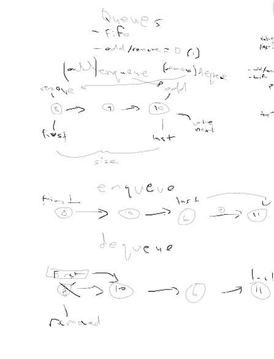
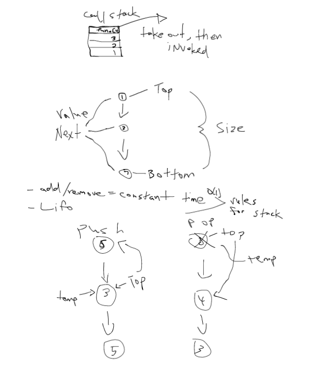
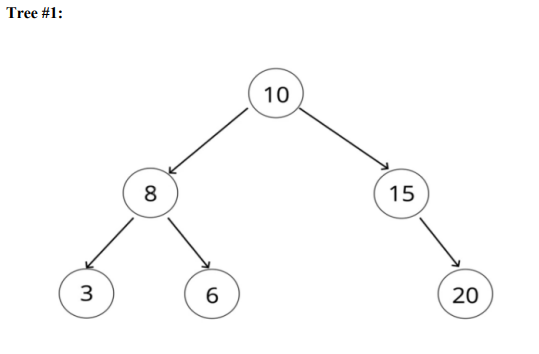
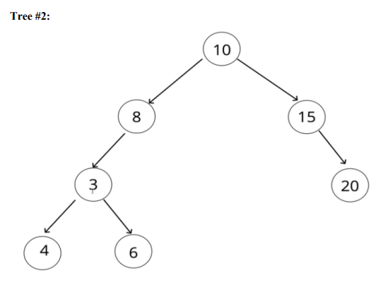
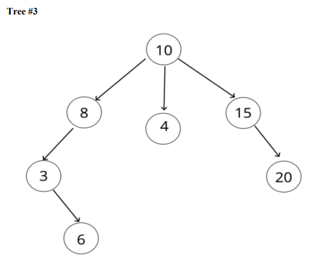
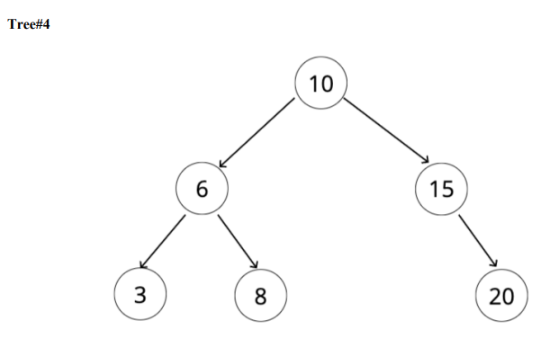
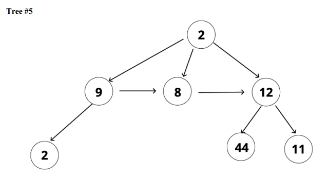
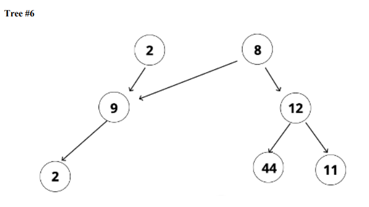

<h2>QUEUES</h2>

<strong>Challenge 1: Draw and explain in a diagram of how the queue data structure works.</strong> 
FIFO structure, first in, first out. First element added will also be the first one out. Real life examples used in any kind of background tasks in the browser or file uploading. 

<strong>Challenge 2: Create 2 methods that are: </strong>
     
    • enqueue (insert a element at the end of the queue) 
    • dequeue (remove a element from the start of the queue)  

        class Node {
            constructor(value){
                this.value = value;
                this.next = null;
            }
        }
        class Queue {
            constructor(){
                this.first = null;
                this.last = null;
                this.size = 0;
            }
            enqueue(val){
                let newNode = new Node(val);

                if(!this.size) {
                    this.first = newNode;
                    this.last = newNode;
                } else {
                    this.last.next = newNode;
                    this.last = newNode;
                }

                this.size++; 
                return this;
            }
            dequeue(){

                if(!this.size) return null;

                let removed = this.first;

                if(this.size === 1) {
                    this.first = null;
                    this.last = null;
                } 

                this.first = this.first.next;

                this.size--;

                return removed;
            }
        }

<strong>Challenge 3: Create 3 additional methods that are: </strong> 
    • peek (retrieves the element at the start of the queue, WITHOUT removing it) 
    • isEmpty (checks if the queue is empty – should return true or false)  
    o hint - what property of the queue can you use to build this method J?  
    • printQueue (prints the elements in the queue) 

<h2>STACKS</h2>

<strong>Challenge 1: Draw and explain in a diagram of how the stack data structure works.</strong> 

LIFO (last one in first one out) data structure, the last element added to the stack will be the first one removed. Used in call stacks, recursions, undo / redo actions and react routing. 
 

<strong>Challenge 2: Create 2 methods that are: </strong> 
    • push (insert a element to the top of the stack) 
    • pop (remove a element from the top of the stack) 

    class Node {
        constructor(value){
            this.value = value;
            this.next = null;
        }
    }
    class Stack {
        constructor(){
            this.top = null;
            this.bottom = null;
            this.size = 0;
        }
        push(val){
            const newNode = new Node(val); 

            if (!this.size) {
                this.top = newNode;
                this.bottom = newNode;
            } else {
                const temp = this.top;

                this.top = newNode;
                this.top.next = temp;
            }

            this.size++;
            return this;

        }
        pop(){
            if (!this.size) return null; 

            let poppedNode = this.top 

            if(this.top === this.bottom){ 
                this.top = null;
                this.bottom = null;
            }

            this.top = this.top.next 
            this.size--; 
            return poppedNode; 
        }
    }

<strong>Challenge 3: Create 3 additional methods that are: </strong> 
• peek (retrieves the element at the top of the stack, WITHOUT removing it) 
• isEmpty (checks if the stack is empty – should return true or false)  
o hint - what property of the stack can you use to build this method J?  
• printStack (prints the elements in the stack) 

<h2>BINARY SEARCH TREES</h2>
<strong>Challenge 1: Given the following illustrations, identify each tree as: </strong> 
- Tree 
- Binary Tree 
- Binary Search Tree 
- Not Applicable 
 
Tree #1: Binary Search Tree - has 1 root, two child at most per parent, left child < parent and right child > parent. 
 
Tree #2: Binary Tree - has 1 root, two child at most per parent. Left child not less than parent so it's a binary tree. 
 
Tree #3: Tree - has 1 root, has three childs 
 
Tree #4: Binary Search Tree - has 1 root, two child at most per parent, left child < parent and right child > parent 
 
Tree #5: Tree - has 1 root  
 
Tree #6: Not Applicable - 2 roots and chaos   
 

<strong>Challenge 2: Create 3 methods that are: </strong> 
• insert (inserts a node as a child of the given parent node) 
• find (retrieves a given node) 
• contains (returns a Boolean if a given node exists) 

        class Node {
            constructor(value){
                this.value = value;
                this.left = null;
                this.right = null;
            }
        }
        class BinarySearchTree {
            constructor(){
                this.root = null;
            }
            insert(value){
                let newNode = new Node(value);

                if (!this.root) {
                    this.root = newNode;
                    return this;
                }

                let current = this.root;
                while (true) {

                    if (value === current.value) return; 

                    if (value < current.value) {
                        if (!current.left) {
                            current.left = newNode;
                            return this;
                        }
                        current = current.left;
                    } else {
                        if (!current.right) {
                            current.right = newNode;
                            return this;
                        }
                        current = current.right;
                    }
                }
            }
            find(value){
                if (!this.root) return;

        
                let current = this.root;

                let found = false;

                while (current && !found) {
                    if (value < current.value) {
                        current = current.left
                    } else if (value > current.value) {
                        current = current.right
                    } else {
                        found = true;
                    }
                }

                return current;
            }
            contains(value){
                if (!this.root) return;

                let current = this.root;
                let found = false;

                while (current && !found) {
                    if (value < current.value) {
                        current = current.left
                    } else if (value > current.value) {
                        current = current.right
                    } else {
                        return true;
                    }
                }

                return false;
            }
        }

<strong>Challenge 3: Create 1 additional method that is: </strong> 
• remove (removes a node and its children from the BST) 
