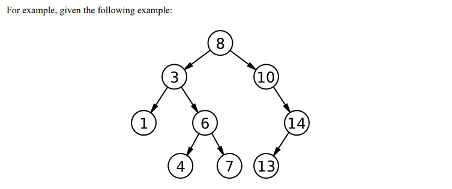
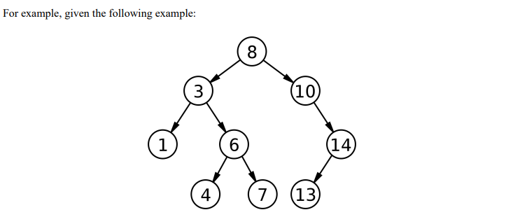
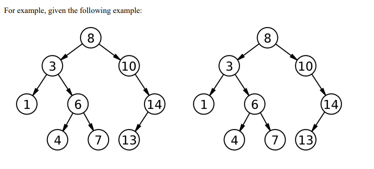

<strong>Challenge 1: Please solve this problem using BFS & DFS. </strong> 

<h5>Given a binary tree, create a method called countLeafs(tree) that returns the count of all the LEAFS of the tree. </h5> 

<h5>For example, given the following example:</h5> 

  
<h5>The following tree when passed in to the countLeafs(tree) function should return 3. </h5> 
<h5>NOTE: countLeafs(tree) takes in a argument of a tree. E.g.</h5> 

<h5>Set-up: </h5> 
<h5>In order to create a tree to test, for example for the following above, you can create this tree like so: </h5> 

        var tree = new BinarySearchTree();
        tree.insert(8);
        tree.insert(3);
        tree.insert(1);
        tree.insert(6);
        tree.insert(4);
        tree.insert(7);
        tree.insert(10);
        tree.insert(14);
        tree.insert(13);
        tree.countLeafs(tree)

 
<strong>Challenge 2: Please solve this problem using either BFS or DFS. </strong> 
<h5>Given a binary tree, create a method called countOdds(tree) that returns a object that has a SORTED list of all odd nodes and count. </h5> 

  

<h5>The following tree when passed in to the countOdds(tree) function should return something like this: </h5> 

            {
            nodes: [1, 3, 7, 13],
            count: 4
            }

<h5>NOTE: countOdds(tree) takes in a argument of a tree. E.g. </h5> 

<h5>Set-up: </h5> 
<h5>In order to create a tree to test, for example for the following above, you can create this tree like so: </h5> 

        var tree = new BinarySearchTree();
        tree.insert(8);
        tree.insert(3);
        tree.insert(1);
        tree.insert(6);
        tree.insert(4);
        tree.insert(7);
        tree.insert(10);
        tree.insert(14);
        tree.insert(13);
        tree.countOdds(tree)

 
<h5>Challenge 3: Please solve this problem using either BFS or DFS. </h5> 
<h5>Given two binary trees, create a method called same(tree1, tree2) that returns true or false if the two binary trees are the same!</h5> 

  
<h5>The following tree when passed in to the same(tree1, tree2) function should return something like this: </h5> 

        true

<h5>NOTE: same(tree1, tree2) takes in a argument of tree1 and tree2. E.g.</h5> 

<h5>Set-up: </h5> 
<h5>In order to create a tree to test, for example for the following above, you can create this tree like so: </h5> 

        var tree1 = new BinarySearchTree();
        var tree2 = new BinarySearchTree();
        tree1.insert(8);
        tree1.insert(3);
        tree1.insert(1);
        tree2.insert(8);
        tree2.insert(3);
        tree2.insert(1);
        tree1.same(tree1, tree2)

