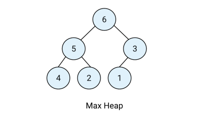

<h1>Week 3 Assignment</h1>

<h2>Challenge 1: Given the following trees, label them as:</h2> 
• Binary Search Tree 
• Max Binary Heap 
• Min Binary Heap  
Tree #1 - BINARY SEARCH TREE 
 
Tree #2 - MAX BINARY HEAP 
 
Tree #3 - MIN BINARY HEAP 
 

<h2>Challenge 2: Given the following max binary heap trees, create a function called maxValue() that returns the VALUE of the largest number in the tree. </h2>  

 

SOLUTION:  

<h2>Challenge 3: Given the following min binary heap tree, create a function called minValue() that returns the 
VALUE of the smallest number in the tree. </h2> 
 

SOLUTION:  

<h2>Challenge 4: Given the following binary heap tree, create a function called isMaxHeap(heap) that accepts a 
heap as a argument, and it should return either true or false if it’s a valid max heap tree. </h2> 
Example below should return TRUE 
 

SOLUTION:  

