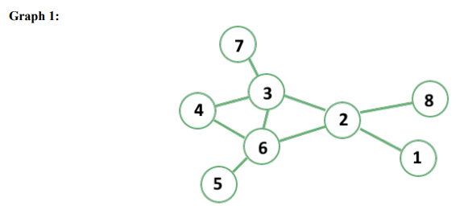
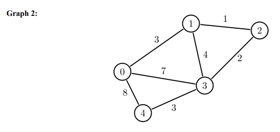
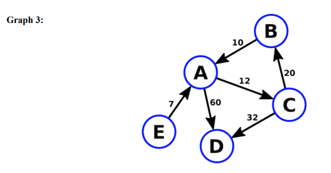
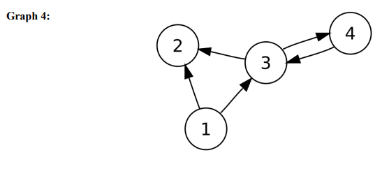

<h3>Challenge 1: Given the following graphs, appropriately label them as being undirected-weighted, directed-weighted, undirected-unweighted, and directed-unweighted.</h3>  
This is undirected-unweighted. 
   
This is undirected-weighted. 
   
This is directed-weighted. 
   
This is directed-unweighted. 
   

<h3>Challenge 2: Define what vertices and edges mean to you. </h3>  

<h3>Challenge 3: You were just hired as a backend engineer for a new start-up to compete with LinkedIn, and your 
first task as a engineer was to create a undirected, unweighted graph of the first 4 users of the website. Create a
Graph class that utilizes a adjacencyList to structure the graph of the mutual connections between each user. </h3>  

<h4>Create the following methods: </h4>  

- addVertex(v): v – vertex to add
- addEdge(v1, v2): v1 – first vertex to add, v2 – second vertex to add
- removeEdge(v1, v2): v1 – first vertex to remove, v2 – second vertex to remove
- removeVertex(v): v – vertex to remove

Step 1: Seed some data - here is the list of friends and their initial mutual connections: 

- Tom Brady: [‘Lebron James’, ‘Tony Kim’]
- Tony Kim: [‘Patrick Mahomes’, ‘Lebron James’, ‘Tom Brady’]
- Patrick Mahomes: [‘Lebron James’]
- Lebron James: [‘Tom Brady’, ‘Tony Kim’, ‘Patrick Mahomes’]

Step 2: Lebron James no longer wants a account on our platform, go ahead and remove the connection between 
those connections.

Should look like this: 
- Tom Brady: [‘Tony Kim’]
- Tony Kim: [‘Patrick Mahomes’, ‘Tom Brady’]
- Patrick Mahomes: []
