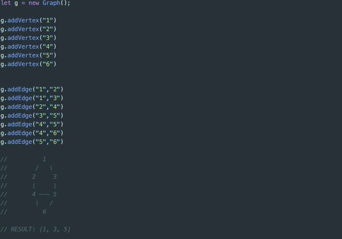
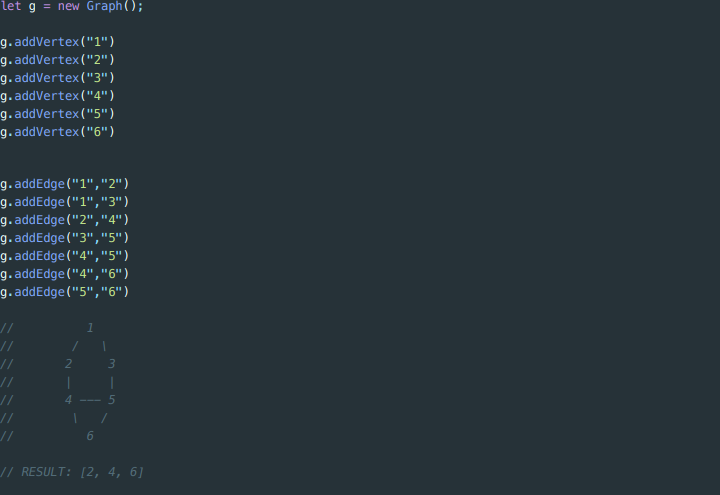
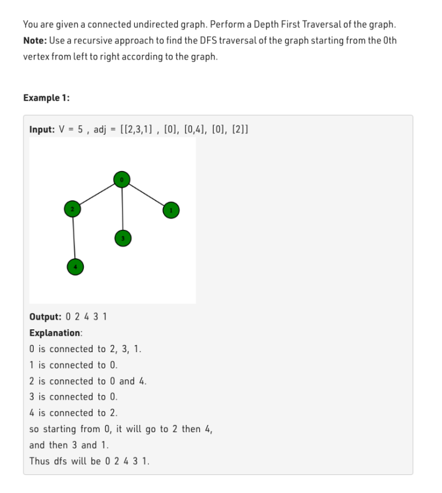

<strong><h2>Week 5 Assignment</h2></strong>

<h3>Challenge 1: Using the DFS (recursive or iterative) method on a undirected, unweighted graph, create a method 
that returns all the odd valued vertices, for example, with the following</h3> 

<h3>Challenge 2: Using the BFS (recursive or iterative) method on a undirected, unweighted graph, create a method 
that returns all the even valued vertices, for example, with the following </h3> 

<h3>Challenge 3:</h3>

